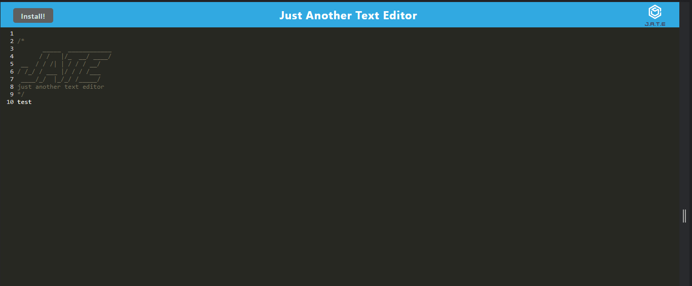
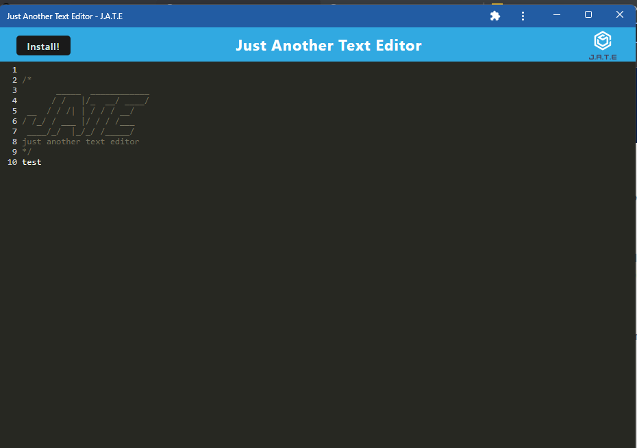

# Code Note Editor


## Description

The Code Note Editor, also known as 'Just Another Text Editor', is a progressive web application. The user can take code notes in the text editor with or without an internet connection. This application functions in the browser and it may also be downloaded to the user's desktop. Notes get saved to IndexedDB so they are not lost after exiting and returning to the application.

## Table of Contents

- [Code Note Editor](#code-note-editor)
  - [Description](#description)
  - [Table of Contents](#table-of-contents)
  - [Installation](#installation)
  - [User Story](#user-story)
  - [Acceptance Criteria](#acceptance-criteria)
  - [License](#license)

## Installation 

Installation is not required as this application has been deployed to Railway.

To install locally, clone the repository and run `npm install` to install the required packages. Next, run `npm run start` from the root directory. Once this is complete, you can visit the application on localhost:3000. 

## User Story

```md
AS A developer
I WANT to create notes or code snippets with or without an internet connection
SO THAT I can reliably retrieve them for later use
```

## Acceptance Criteria

```md
GIVEN a text editor web application
WHEN I open my application in my editor
THEN I should see a client server folder structure
WHEN I run `npm run start` from the root directory
THEN I find that my application should start up the backend and serve the client
WHEN I run the text editor application from my terminal
THEN I find that my JavaScript files have been bundled using webpack
WHEN I run my webpack plugins
THEN I find that I have a generated HTML file, service worker, and a manifest file
WHEN I use next-gen JavaScript in my application
THEN I find that the text editor still functions in the browser without errors
WHEN I open the text editor
THEN I find that IndexedDB has immediately created a database storage
WHEN I enter content and subsequently click off of the DOM window
THEN I find that the content in the text editor has been saved with IndexedDB
WHEN I reopen the text editor after closing it
THEN I find that the content in the text editor has been retrieved from our IndexedDB
WHEN I click on the Install button
THEN I download my web application as an icon on my desktop
WHEN I load my web application
THEN I should have a registered service worker using workbox
WHEN I register a service worker
THEN I should have my static assets pre cached upon loading along with subsequent pages and static assets
WHEN I deploy to Heroku
THEN I should have proper build scripts for a webpack application


The following GitHub repo url is: https://github.com/hoffh-5334/text-editor

Deployed application on Railway: https://text-editor-production-202d.up.railway.app/

Screenshot of the application in the browser:



Screenshot of the downloaded desktop application:



## License 

MIT License

